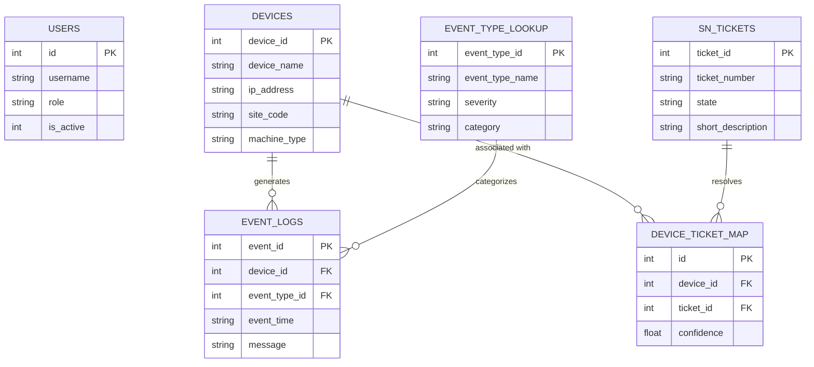
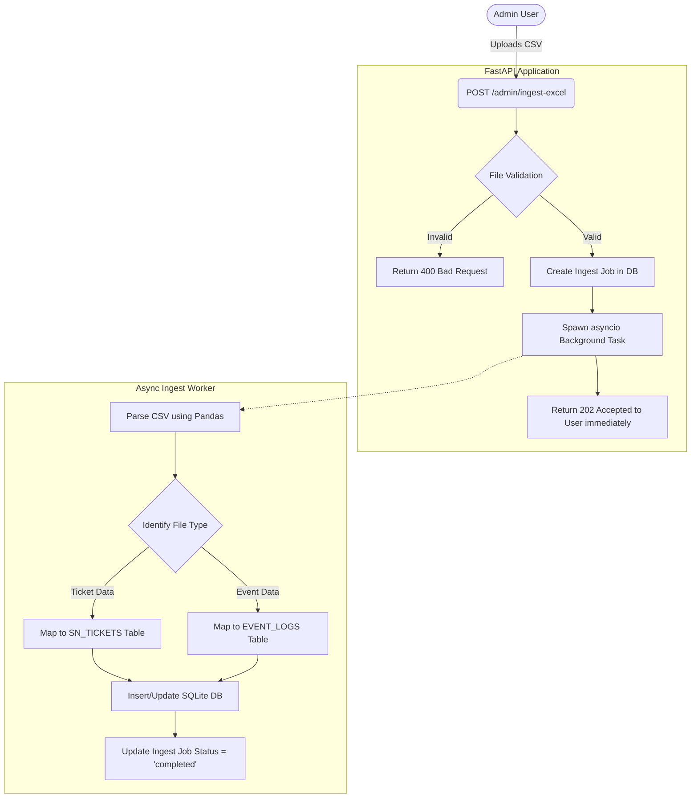
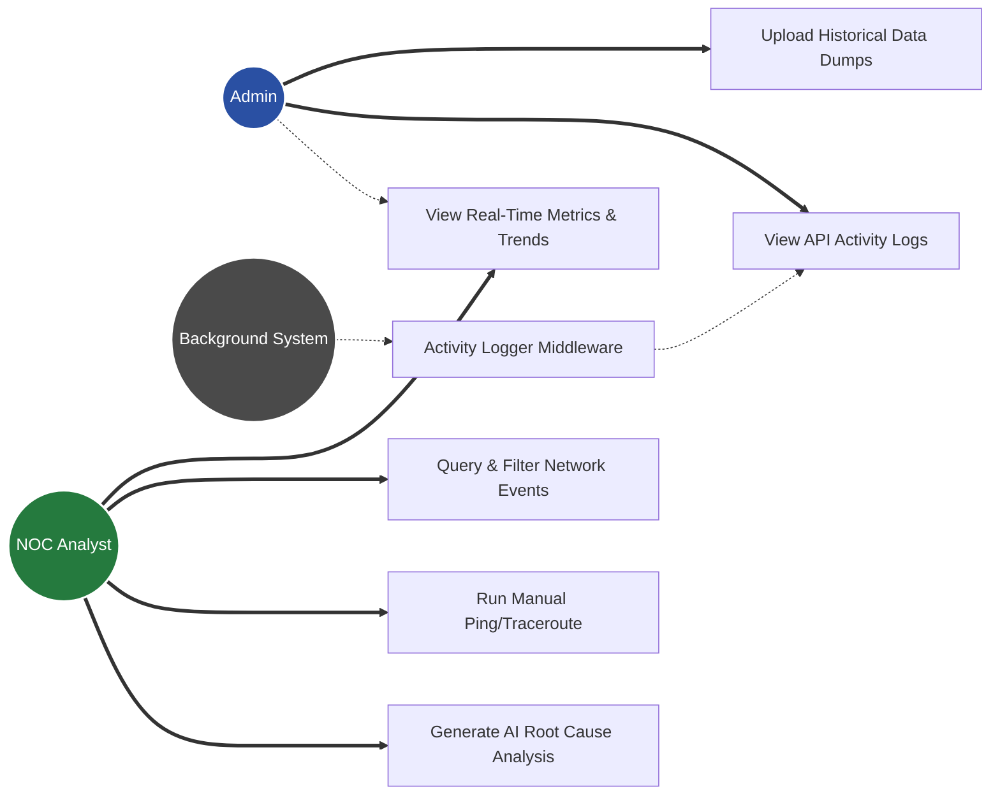

# NOC Automation System Diagrams

Below are the architectural and workflow diagrams for the NOC Automation platform. These diagrams are rendered using Mermaid.

## 1. Sequence Diagram: Automated Alert Analysis
This diagram maps out the core workflow when an analyst requests root cause analysis for a network alert.

```mermaid
sequenceDiagram
    actor Analyst
    participant UI as NOC Dashboard
    participant API as FastAPI Backend
    participant DB as SQLite DB
    participant Diag as Diagnostic Engine
    participant LLM as Gemini API

    Analyst->>UI: Click on Network Alert
    UI->>API: GET /error-info (device_id, event_id)
    
    rect rgb(30, 30, 30)
    Note over API,DB: Data Gathering
    API->>DB: Query Device & Event details
    DB-->>API: Return Context
    API->>DB: Query ServiceNow Tickets
    DB-->>API: Return Historical Incident Data
    end
    
    rect rgb(30, 30, 30)
    Note over API,Diag: Preliminary Checks
    par Diagnostic Execution
        API->>Diag: Execute internal/ping
        Diag-->>API: Return Packet Loss & RTT
    and
        API->>Diag: Execute internal/traceroute
        Diag-->>API: Return Network Hops
    end
    end
    
    rect rgb(30, 30, 30)
    Note over API,LLM: AI Synthesis
    API->>LLM: Send structured prompt (Context + Diagnostics)
    LLM-->>API: Return Hypothesis & Steps (JSON)
    end
    
    API-->>UI: Return Full Analysis Panel
    UI-->>Analyst: Render actionable solution
```

---

## 2. Entity-Relationship Diagram (ERD)
This diagram illustrates the relational database schema, highlighting how devices map to both historical ServiceNow tickets and active event logs.

---

## 3. Flow Diagram: Background Data Ingestion
This chart demonstrates how large CSV/Excel files (Event dumps or ServiceNow ticket dumps) are ingested asynchronously without blocking the main REST API.

---

## 4. Use Case Diagram
This outlines the primary system interactions based on user roles (Admin vs. NOC Analyst).

