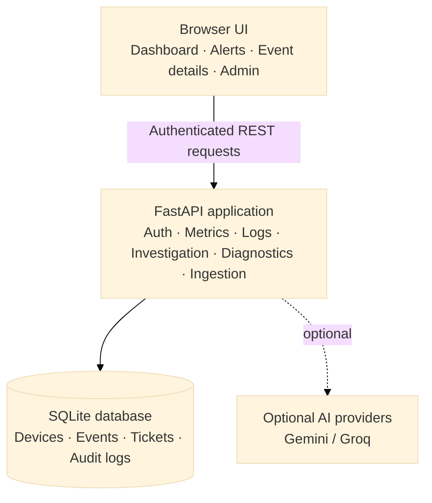
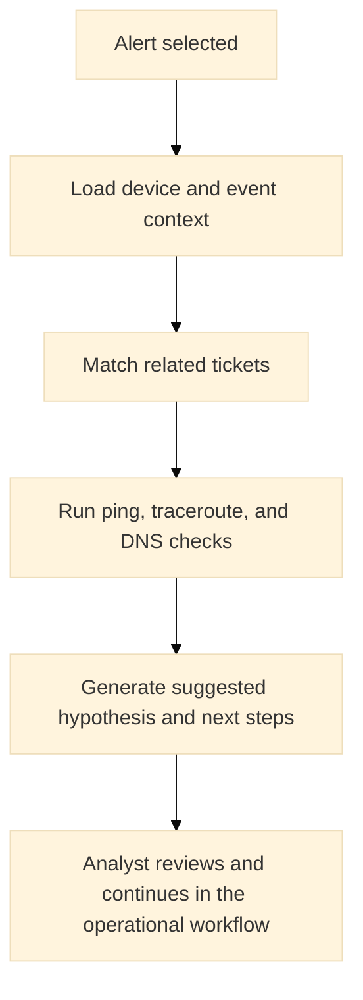
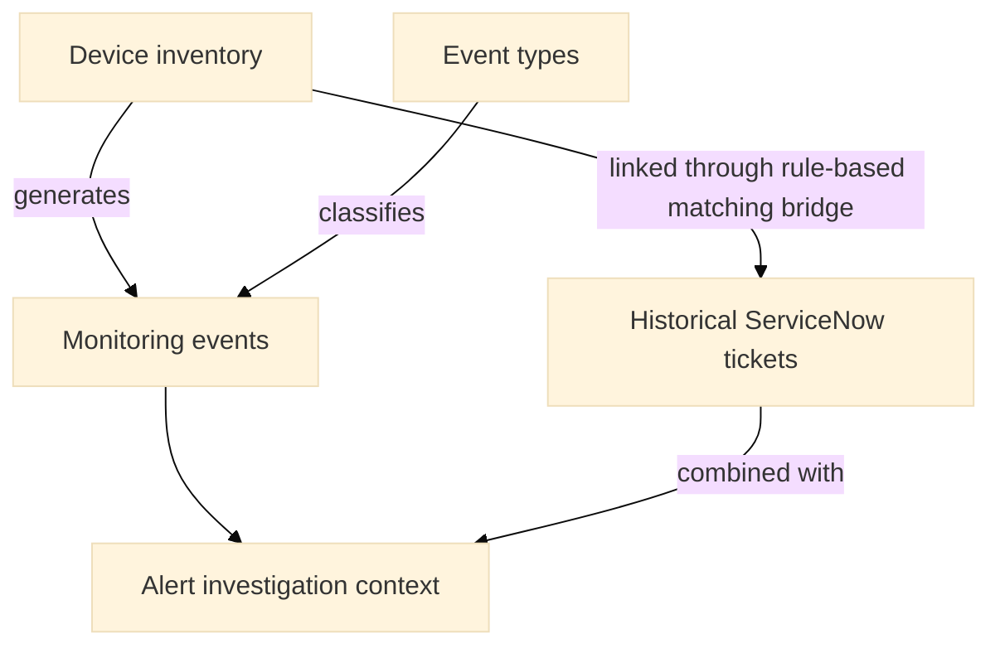
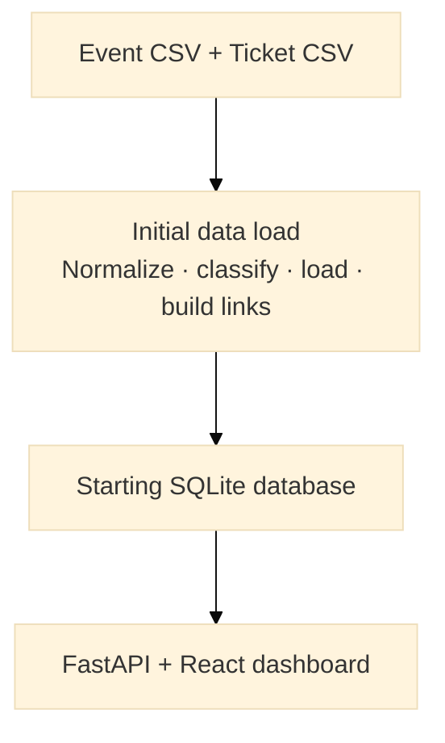
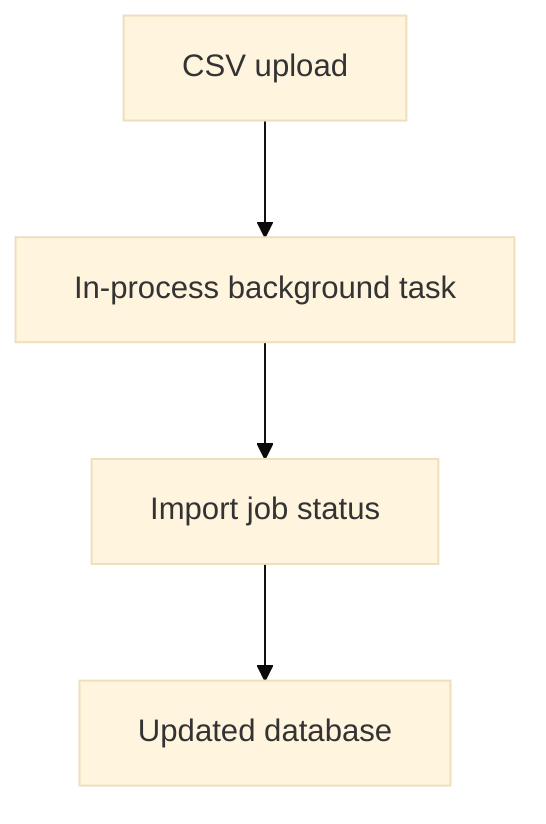
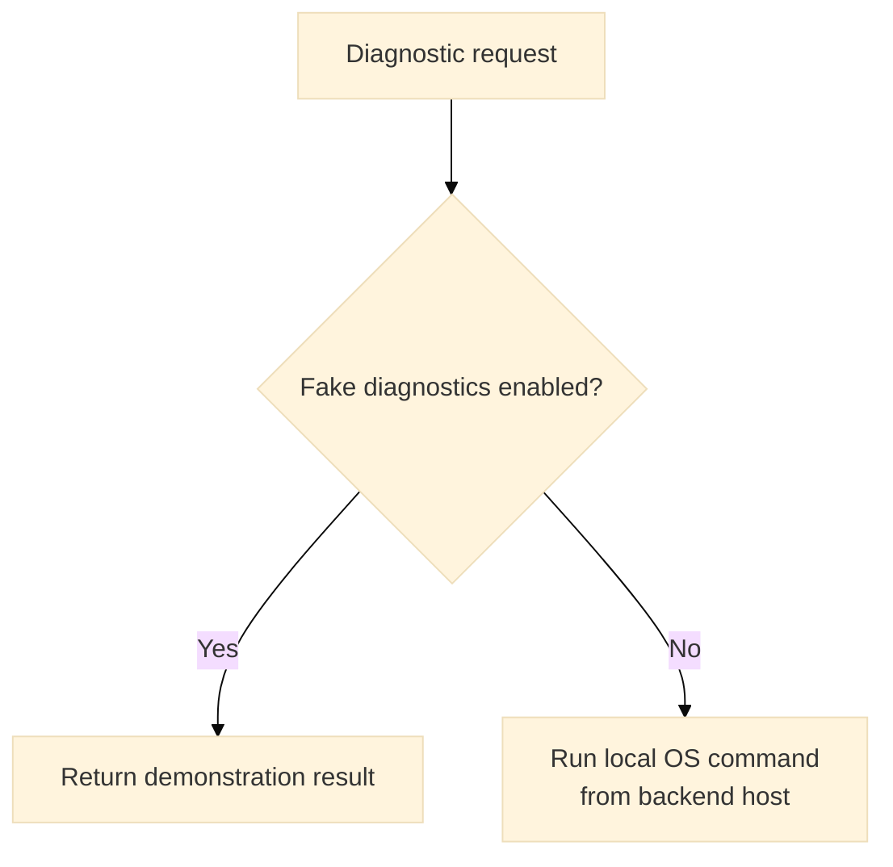
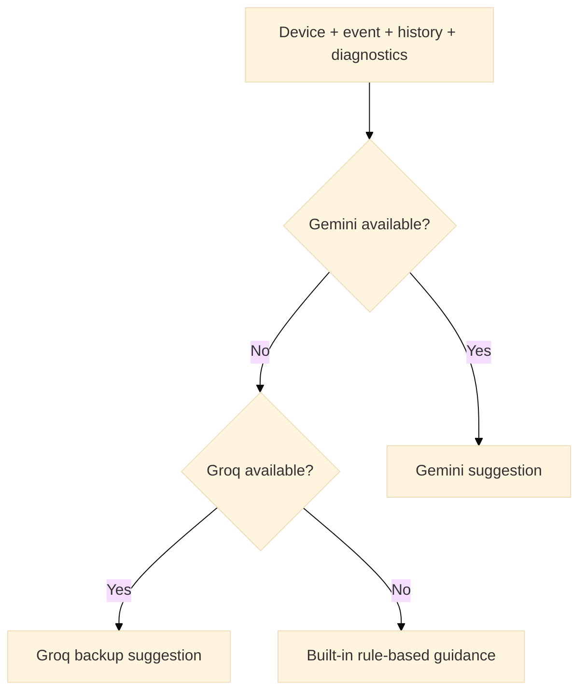
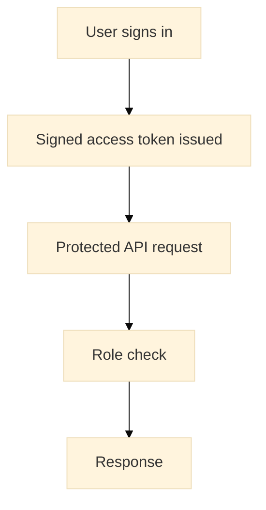

# Network Alerts Automation Platform (NAAP)

## Team and manager briefing

> A workspace for reviewing network alerts, checking historical ticket context, running preliminary diagnostics, and preparing the next analyst action.

| Status | Audience | Reviewed |
|---|---|---|
| Prototype / pilot foundation | NOC leadership, analysts, product and engineering teams | 8 October 2026 |

## Executive summary

NAAP brings alert investigation into one workflow. An analyst can find an alert, review the affected device, see related ServiceNow history, run preliminary checks, and receive suggested next steps.

The platform currently includes:

- React dashboard and alert console;
- FastAPI backend with authenticated API access;
- SQLite data store for devices, events, tickets, users, and audit records;
- simulated diagnostics by default, with optional local diagnostics; and
- optional AI-assisted recommendations with built-in rule-based backup guidance.

**Important positioning:** this is an analyst-assistance platform backed by a prepared anonymized dataset. It is not currently a live monitoring replacement, autonomous remediation system, or resilient multi-server production platform.

## Current value

| User | Value provided |
|---|---|
| NOC analyst | One place to investigate an alert and review prior ticket context |
| NOC lead | Consistent alert-investigation workflow and visibility into alert patterns |
| Engineering team | Clear separation between UI, API, diagnostics, data, and AI services |
| Management | A demonstrable foundation with specific gaps identified before moving toward production |

## Platform overview

### Architecture



The browser never talks directly to the database. The backend assembles the data, applies access rules, runs diagnostics, and returns a single response to the UI.

### Analyst alert-investigation flow



The system does not change network configuration or create/update ServiceNow tickets.

### Technology shape

| Layer | Technology | Responsibility |
|---|---|---|
| Frontend | React 19, Vite, React Router, Zustand, Recharts | Pages, navigation, session state, dashboards, and API calls |
| Backend | Python, FastAPI, Pydantic | Authentication, routing, validation, orchestration, and JSON responses |
| Persistence | SQLite with application migrations | Devices, events, tickets, users, audit records, and ingest jobs |
| Data processing | Pandas and OpenPyXL | CSV/XLSX parsing and normalization |
| Assistance | Gemini, Groq, or built-in rules | Suggested hypotheses and remediation steps |

## User-facing capabilities

### Dashboard and alerts

- Dashboard metrics for event volume, severity, category, top alerting devices, and ticket statistics.
- Searchable and paginated alert list.
- Event simulation for demonstrations and UI testing.

The dashboard’s “recent” counts and trends are estimates because the source event records do not preserve calendar dates.

### Event details

The event-details view brings together:

| Information | Purpose |
|---|---|
| Device and event | Identify what is affected |
| Related tickets | Check whether the issue has occurred before |
| Preliminary checks | See whether the target responds from the backend host |
| Suggested solution | Identify what to verify next |

Recommendations are advisory. The analyst remains responsible for validation and operational action.

### Administration

Administrators can view API activity records and submit CSV files for background ingestion. The admin screen uploads through `/admin/ingest-excel`, polls the returned job until it completes, and supports the repository's event and ticket export headers. Typed CSV routes remain available for integrations. Large uploads are processed in the API process and can take around two minutes for the supplied event export; a restart can still interrupt a job. Ingest-job status polls are excluded from the activity log to avoid noisy writes during imports; job state remains available from the ingest-job endpoint.

### Offline demo

The frontend includes a local demo mode. It uses mock data and does not call the backend.

| Demo account | Password |
|---|---|
| `admin` | `admin123` |
| `admin12` | `adminpassword123!` |

These credentials are for demonstration only.

## Backend capability map

The backend interface is organized around a small set of business capabilities rather than a large public surface.

| Capability | Main routes | Primary user |
|---|---|---|
| Authentication | `/auth/login`, `/auth/signup`, `/auth/logout`, `/auth/me` | All users |
| Dashboard and search | `/get-metrics`, `/get-logs` | Analyst and admin |
| Alert investigation | `/error-info` | Analyst and admin |
| Diagnostics | `/internal/ping`, `/internal/traceroute`, `/internal/nslookup` | Analyst and admin |
| Demonstration | `/simulate/logs` | Analyst and admin |
| Administration | `/admin/activity-log`, `/admin/ingest/...` | Admin |
| Saved guidance | `/solution-summaries` | Authenticated users; write access for analyst/admin |

The running FastAPI application remains the authoritative source for request parameters and response shapes. Interactive documentation is available at `/docs` and `/redoc`.

## Data landscape

### Baseline database snapshot

| Data set | Records |
|---|---:|
| Devices | 6,583 |
| Monitoring events | 134,385 |
| Event types | 91 |
| ServiceNow tickets | 442 |
| Device-ticket links | 2,314 |

The repository contains multiple SQLite snapshots. The active database is selected by `DATABASE_URL`.

### Data relationship



### Data limitations

- Event dates are missing; only time-of-day values are available.
- Some events do not map cleanly to a device.
- Some ticket ownership and structured fields are unavailable.
- Site code, device name, and IP matching uses rules and must be confirmed operationally.
- The data is an anonymized/static extract, not a live monitoring feed.

### Data processing paths

| Path | Use | Location |
|---|---|---|
| Initial build | Recreate the starting database from source CSV files | `noc_database_setup 1/etl_pipeline.py` |
| Incremental update | Merge new event and ticket CSV files | `incremental_updater.py` |
| API upload | Accept an administrator CSV upload and create an ingest job | `backend/workers/ingest_worker.py` |

The paths do not share exactly the same normalization logic. The API upload path has been tested with the supplied full-size event and ticket exports, while the standalone updater is the preferred controlled refresh path for bulk updates. Validate the resulting database before using it operationally.

## Operational flows

### Data refresh and ingestion



For administrator uploads:



The upload task runs inside the API process. A restart can interrupt an active job; it is not a durable queue.

### Diagnostic behavior



Fake mode is the default. Results from fake mode must not be treated as evidence of actual device reachability.

### Recommendation behavior



The recommendation is a hypothesis and action guide, not a verified root cause or automatic change plan.

### AI behavior and governance

- Gemini is attempted first when `GEMINI_API_KEY` is configured.
- Groq is attempted when Gemini is unavailable and `GROQ_API_KEY` is configured.
- Rule-based guidance is used when external providers are unavailable.
- The prompt uses compact device, event, diagnostic, and ticket context; it is not a full ticket export.
- Successful Gemini/Groq suggestions are saved per event and returned directly for `SOLUTION_SUMMARY_CACHE_TTL_MINUTES` (10 minutes by default); rule-based fallbacks are not cached.

AI output should be reviewed by an analyst before it is copied into a ServiceNow record or used to justify a change.

## Security and access



| Role | Access |
|---|---|
| Analyst | Dashboard, alerts, alert investigation, diagnostics, and solution summaries |
| Admin | Analyst access plus ingestion and activity-log access |

The repository still contains development defaults for the token-signing secret and bootstrap admin password. These must be replaced before any shared deployment.

### Configuration that must be reviewed

| Setting | Current default | Team decision |
|---|---|---|
| `DATABASE_URL` | Local absolute SQLite path | Set per environment |
| `SECRET_KEY` | Development placeholder | Generate and protect a deployment secret |
| `ADMIN_PASSWORD` | `admin123` | Replace before shared use |
| `FAKE_DIAGNOSTICS` | `True` | Keep for demos; disable only when real checks are approved |
| `DEV_LOG_ENABLED` | `False` | Keep disabled unless development request/SQL logging is needed |
| `CORS_ORIGINS` | Declared as permissive, while `main.py` has its own allowlist | Align configuration and runtime behavior |

## Readiness assessment

### Ready for

- Demonstrating the end-to-end alert-investigation concept.
- Reviewing the prepared dataset with analysts and stakeholders.
- Validating UI workflows and API boundaries.
- Prototyping AI-assisted operational guidance.

### Not ready for

- Live monitoring ingestion.
- Autonomous remediation.
- Guaranteed calendar-based trend analysis.
- Durable, restart-safe ingestion.
- Resilient multi-server or horizontally scaled deployment.

### Priority gaps

| Priority | Gap | Why it matters |
|---:|---|---|
| 1 | Replace in-process ingestion | Prevents lost work during API restarts |
| 2 | Preserve full event timestamps | Required for trustworthy trends and event/ticket correlation |
| 3 | Remove development secrets and logging defaults | Required before shared access |
| 4 | Label simulated diagnostics clearly | Prevents demo results being mistaken for live evidence |

## Local operation

### Start the backend

```bash
cd backend
python3 -m venv .venv
source .venv/bin/activate
pip install -r requirements.txt
uvicorn main:app --reload --host 0.0.0.0 --port 8000
```

### Start the frontend

```bash
cd frontend
npm install
npm run dev
```

The backend provides interactive API documentation at `/docs` and `/redoc`.

For database rebuilds and validation, use the scripts and SQL files under `noc_database_setup 1/`. For incremental CSV updates, use `incremental_updater.py`.

The updater defaults to the SQLite path in the backend configuration and can be pointed at a staging copy with `--db`. Run it from the repository root after creating that copy:

```bash
backend/.venv/bin/python incremental_updater.py \
    --events "30_Days_EventTypeName_device_name_ANONYMIZED.csv" \
    --tickets "SN_Tickets_NOC_anonymized.csv" \
    --db /path/to/staging-copy.db
```

The event export contains time-of-day only; the updater preserves that value and does not invent calendar dates. Review the staging database before selecting the configured live database as the target.

## Verification checklist

After a change, confirm:

1. Backend tests pass when dependencies are installed.
2. The frontend production build completes.
3. `/health` responds successfully.
4. Login, dashboard, alert search, and event details work with a known database snapshot.
5. Fake diagnostics are visibly identified as simulated.
6. CSV ingestion creates a job and reaches a terminal status.

## Repository references

| Area | Location |
|---|---|
| Backend | `backend/` |
| Frontend | `frontend/` |
| Initial data loading and schema | `noc_database_setup 1/` |
| Incremental updates | `incremental_updater.py` |
| Database query reference | `query.sql` |
| Data-quality findings | `noc_database_setup 1/data_quality_report.md` |

When this briefing and the implementation disagree, use the running FastAPI OpenAPI output, active configuration, database schema, and frontend code as the source of truth.
